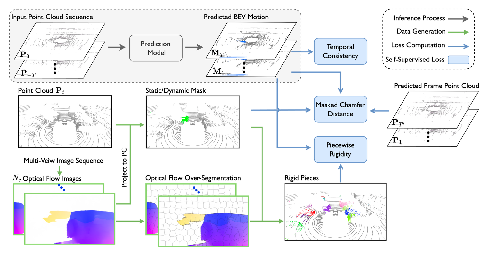

# Self-supervised-motion

This is the repository that contains source code for the paper:

**[AAAI 2024] Self-Supervised Bird’s Eye View Motion Prediction with Cross-Modality Signals**



## Installation

Create environment and install pytorch.
```
conda create --name sf python=3.8 -y
conda activate sf
conda install pytorch==1.11.0 torchvision==0.12.0 torchaudio==0.11.0 cudatoolkit=11.3 -c pytorch
```

Install [spconv v1.2.1](https://github.com/traveller59/spconv/tree/v1.2.1), [pytorch3d](https://github.com/facebookresearch/pytorch3d/blob/main/INSTALL.md) and [pypcd](https://github.com/dimatura/pypcd).

Install pointnet2
```
cd lib/pointnet2
python3 setup.py install
```

Other dependencies
```
pip install -r requirements.txt
```

## Data Preparation

For detailed instructions refer to [data_preparation](./data_prepare/README.md).


## Training
```
./train.sh
```

## Citation
```
@article{fang2024self,
  title={Self-Supervised Bird's Eye View Motion Prediction with Cross-Modality Signals},
  author={Fang, Shaoheng and Liu, Zuhong and Wang, Mingyu and Xu, Chenxin and Zhong, Yiqi and Chen, Siheng},
  journal={arXiv preprint arXiv:2401.11499},
  year={2024}
}
```

## Credits

This repository is based on the implementations of following repositories:
- [motionnet](https://github.com/pxiangwu/MotionNet)
- [flowstep3d](https://github.com/yairkit/flowstep3d)
- [pillar-motion](https://github.com/qcraftai/pillar-motion)
